# Current Implementation Architecture

Last updated: 2026-05-27

This diagram reflects the current implementation phase for the Rust `kryptos-k4` research CLI. It describes source-grounded research tooling only; it does not claim a Kryptos K4 solution.

```mermaid
flowchart TD
    User["CLI user / researcher"] --> Cli["kryptos-k4 CLI"]
    User --> BackgroundScripts["background batch scripts"]

    Cli --> Facts["facts / anchors / sources"]
    Cli --> Constraints["constraints / key-fragments"]
    Cli --> KeyTest["test-key / explain-key / batch-test-keys / summarize-key-runs"]
    Cli --> PositionStructure["position-structure / structural-models"]
    Cli --> PredictionTargets["validate-preregistration / prediction plans / validate-prediction-artifact"]
    Cli --> IndependentObservations["validate observations / evaluate predictions"]
    Cli --> Baseline["baseline controls"]
    Cli --> Candidates["candidate-sequences"]
    Cli --> Routes["routes"]
    Cli --> Findings["findings"]
    Cli --> Report["report"]
    Cli --> Export["export-data"]
    Cli --> Release["release-check"]
    BackgroundScripts --> BatchLoop["run-key-batch-loop.sh timestamped batch loop"]
    BackgroundScripts --> StartStop["start / stop wrappers with flags"]
    BatchLoop --> KeyTest

    Facts --> Data["src/data.rs public ciphertext, anchors, sources"]
    Constraints --> Data
    Constraints --> Alphabets["src/alphabet.rs standard, Kryptos, reversed Kryptos"]
    KeyTest --> KeyTestModel["src/key_test.rs proposed material checks"]
    KeyTest --> CandidateModel["src/candidates.rs transforms"]
    KeyTest --> Analysis["src/analysis.rs anchor/span fragments"]
    PositionStructure --> PositionModel["src/position_structure.rs residue, spacing, and period models"]
    PredictionTargets --> PositionModel
    IndependentObservations --> PositionModel
    IndependentObservations --> SourcePolicy["source allowed-use gates"]
    Baseline --> Analysis["src/analysis.rs anchor/span fragments"]
    Candidates --> CandidateModel["src/candidates.rs pre-registered contextual material"]
    Routes --> RouteModel["src/routes.rs bounded named route families"]
    Findings --> FindingsModel["src/findings.rs findings ledger"]
    Report --> ReportModel["src/report.rs Markdown / JSON report model"]
    Export --> Data
    Release --> ReleaseModel["src/release_check.rs local release gates"]

    Data --> SourcePacket["sources/source-packet.md quote-free source summaries"]
    Data --> SourcePolicy
    Data --> ResearchPlan["kryptos-k4-research-plan.md scope, hypotheses, next tests"]
    ReportModel --> GeneratedReport["notes/k4-report.md generated release report"]
    BatchLoop --> BatchArtifacts["results/key-tests ignored local artifacts"]
    KeyTest --> BatchArtifacts
    FindingsModel --> ReportModel
    ReleaseModel --> GeneratedReport
    ReleaseModel --> SourcePacket
    ReleaseModel --> ResearchPlan

    Tests["tests/cli_e2e.rs + unit tests"] --> Cli
    Tests --> ReleaseModel
```

## Current Guarantees

- Public K4 ciphertext, public anchors, and source provenance are modeled in Rust.
- Constraint, ciphertext-profile, ciphertext-structure-prior, ciphertext-hotspot, ciphertext-rarity, ciphertext-transition, ciphertext-skip-transition, ciphertext-turning-point, ciphertext-residue-balance, key-material test/explanation, baseline, candidate, route, preregistration, prediction-artifact, independent-lane-status, independent-observation, findings, report, export, and release-check commands are implemented.
- Candidate, route, and baseline outputs carry non-promotion boundaries and next-test metadata.
- `test-key`, `explain-key`, and `batch-test-keys` compare proposed material against public span-derived additive fragments at actual K4 positions, can sweep cyclic phase offsets, can print exact matching rows, can report descriptive pattern metrics and composite pattern scores, can run seeded shuffled-value and candidate-file-level baselines, and never promote candidates.
- `ciphertext-profile` reports ciphertext-only frequency, repeated n-gram spacing, index-of-coincidence, period-coincidence diagnostics, and optional seeded shuffle baselines without using public anchors, candidate material, or claimed plaintext as evidence.
- `ciphertext-structure-prior` turns the weak ciphertext-only period-2 spacing and period-7 shifted-coincidence diagnostics into a planning-only future-observation prior. It excludes public anchor positions from residue targets and is not scored evidence.
- The ciphertext-only prior evaluators can score source-backed non-anchor observation files against planning-only ciphertext-derived targets with seeded non-anchor position-shuffle controls. The CIA row-boundary observation is negative under the committed ciphertext evaluators: ciphertext-prior `p=0.6845`, ciphertext-hotspot `p=1.0000`, ciphertext-rarity `p=0.5282`, ciphertext-transition `p=1.0000`, ciphertext-skip-transition `p=1.0000`, ciphertext-turning-point `p=0.5247`, and ciphertext-residue-balance `p=0.4803`; no ciphertext-only prior promotes a candidate.
- `summarize-key-runs` scans historical batch result folders and ranks both individual run rows and per-candidate p-value stability.
- Preregistration, prediction-artifact, independent-lane-status, observation-file, period-prediction, spacing-prediction, mirror-prediction, grid-layout, and Tableau/HILL gates keep independent non-anchor position targets separate from public-anchor-derived fragments before scoring.
- Period, spacing, mirror, grid, and Tableau/HILL prediction evaluations distinguish diagnostic ad hoc `--positions` input from source-backed `--positions-file` evidence; source-backed files require preregistration-backed artifact validation before scoring.
- Observation files must cite source IDs with a scored-evidence-compatible `allowed_use`; public anchor, clue context, methodology context, and archive context sources remain non-scored context.
- The first source-backed row-boundary observation is committed and summarized, but its period, spacing, mirror, grid, Tableau/HILL, and ciphertext-only prior evaluations are negative under seeded null controls and promote no candidate.
- Background wrapper scripts can run repeated `batch-test-keys` experiments with explicit flags, timestamped local artifacts, latest-result pointers, and optional macOS keep-awake support.
- Local release verification is implemented without GitHub Actions and also guards committed prediction artifacts, committed source-backed observation files, committed evidence summaries, committed source-review files, local source-archive structure, source-input references, and the intentionally non-scorable observation template.
- E2E tests execute the compiled CLI and validate command outputs.

## Keep Updated

Update this file when a new command, report section, source model, release gate, or E2E path is added or removed.
