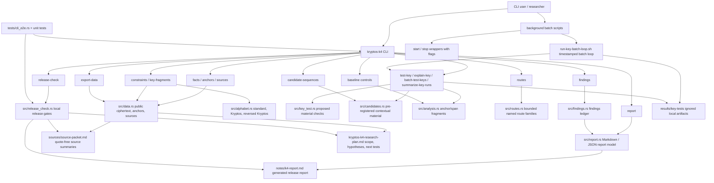

# Current Implementation Architecture

Last updated: 2026-05-22

This diagram reflects the current implementation phase for the Rust `kryptos-k4` research CLI. It describes source-grounded research tooling only; it does not claim a Kryptos K4 solution.

## Current Guarantees

- Public K4 ciphertext, public anchors, and source provenance are modeled in Rust.
- Constraint, key-material test/explanation, baseline, candidate, route, findings, report, export, and release-check commands are implemented.
- Candidate, route, and baseline outputs carry non-promotion boundaries and next-test metadata.
- `test-key`, `explain-key`, and `batch-test-keys` compare proposed material against public span-derived additive fragments at actual K4 positions, can sweep cyclic phase offsets, can print exact matching rows, can report descriptive pattern metrics, can run seeded shuffled-value and candidate-file-level baselines, and never promote candidates.
- `summarize-key-runs` scans historical batch result folders and ranks both individual run rows and per-candidate p-value stability.
- Background wrapper scripts can run repeated `batch-test-keys` experiments with explicit flags, timestamped local artifacts, latest-result pointers, and optional macOS keep-awake support.
- Local release verification is implemented without GitHub Actions.
- E2E tests execute the compiled CLI and validate command outputs.

## Keep Updated

Update this file when a new command, report section, source model, release gate, or E2E path is added or removed.
