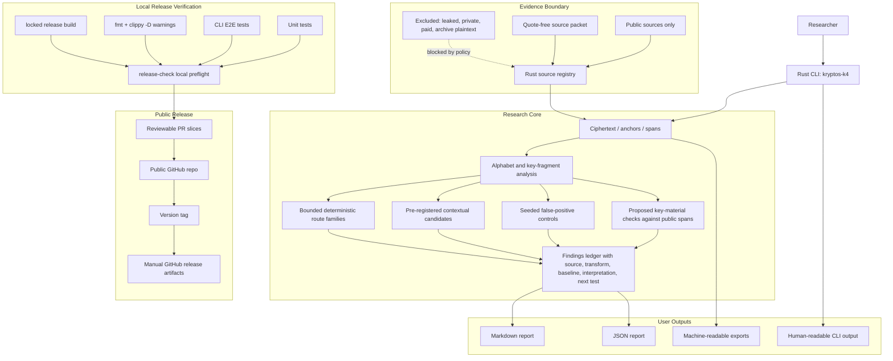

# Production Goal Architecture

Last updated: 2026-05-21

The production goal is a public, source-grounded Rust research CLI and release package with reproducible local verification. Production readiness does not mean Kryptos K4 is solved, and it does not mean speculative plaintext, keys, routes, or methods are promoted.

## Production Goal Gates

- Every factual source in the plan is registered in Rust and documented in the source packet.
- Every finding includes source inputs, transformation steps, baseline comparison, interpretation, and next test.
- Every command has E2E coverage for success paths and important guardrails.
- Proposed key material and cyclic phase offsets are evaluated only against public known-plaintext spans and remain non-promotional unless future independently justified evidence changes the release boundary.
- `cargo fmt --check`, `cargo clippy --locked --all-targets --all-features -- -D warnings`, `cargo test --locked --all-targets --all-features`, `cargo build --locked --release`, and `cargo run --locked -- release-check` pass locally.
- Releases remain manual and local-gated; no GitHub Actions or Dependabot policy drift.

## Keep Updated

Update this file when the release target changes, when a new production gate is added, or when the evidence boundary changes.
